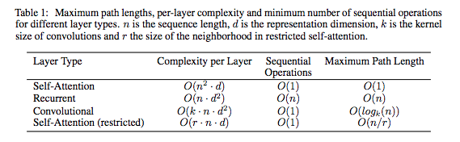

# ChatBot(transformer) 
Transformer를 활용한 ChatBot을 개발함

# Architecture 
  

# Attention 
  

# Scaled Dot-Product Attention 
  

#  Multi-Head Attention 
 

#  Position-wise Feed-Forward Networks 
 

#  Positional Encoding  
 
 

# Regularization 
 

# Learning Data
Title|Contents|Other
--|--|--
데이터 이름|Chatbot data
데이터 용도|한국어 챗봇  학습을 목적으로 사용한다.
데이터 권한|MIT 라이센스
데이터 출처|https://github.com/songys/Chatbot_data (송영숙님)

# Requirement
Python 3.6.6   
tensorflow 1.11   
konlpy   
pandas   
sklearn   

# Project Structure
    .
    ├── data_in                     # 데이터가 존재하는 영역
        ├── ChatBotData.csv         # 전체 데이터
        ├── ChatBotData.csv_short   # 축소된 데이터 (테스트 용도)
        ├── README.md               # 데이터 저자 READMD 파일
    ├── data_out                    # 출력 되는 모든 데이터가 모이는 영역
        ├── vocabularyData.voc      # 사전 파일
        ├── check_point             # check_point 저장 공간
        ├── model                   # model 저장 공간
    ├── configs.py                  # 모델 설정에 관한 소스
    ├── data.py                     # data 전처리 및 모델에 주입되는 data set 만드는 소스
    ├── main.py                     # 전체적인 프로그램이 시작되는 소스
    ├── model.py                    # 모델이 들어 있는 소스
    └── predict.py                  # 학습된 모델로 실행 해보는 소스      
   

# Config
tf.app.flags.DEFINE_integer('batch_size', 64, 'batch size') # 배치 크기  
tf.app.flags.DEFINE_integer('train_steps', 20000, 'train steps') # 학습 에포크  
tf.app.flags.DEFINE_float('dropout_width', 0.5, 'dropout width') # 드롭아웃 크기 
tf.app.flags.DEFINE_integer('hidden_size', 128, 'weights size') # 가중치 크기 # 논문 512 사용 
tf.app.flags.DEFINE_float('learning_rate', 1e-3, 'learning rate') # 학습률  
tf.app.flags.DEFINE_integer('shuffle_seek', 1000, 'shuffle random seek') # 셔플 시드값  
tf.app.flags.DEFINE_integer('max_sequence_length', 25, 'max sequence length') # 시퀀스 길이  
tf.app.flags.DEFINE_integer('embedding_size', 128, 'embedding size') # 임베딩 크기 # 논문 512 사용 학습 속도 및 성능 튜닝  
tf.app.flags.DEFINE_integer('query_dimention', 128, 'q#uery dimention') # 논문 512 사용 학습 속도 및 성능 튜닝  
tf.app.flags.DEFINE_integer('key_dimention', 128, 'key dimention') # 논문 512 사용 학습 속도 및 성능 튜닝  
tf.app.flags.DEFINE_integer('value_dimention', 128, 'value dimention') # 논문 512 사용 학습 속도 및 성능 튜닝  
tf.app.flags.DEFINE_integer('layers_size', 2, 'layers size') # 논문은 6개 레이어이나 2개 사용 학습 속도 및 성능 튜닝  
tf.app.flags.DEFINE_integer('heads_size', 4, 'heads size')# 논문은 8개 헤더이나 4개 사용 학습 속도 및 성능 튜닝  
tf.app.flags.DEFINE_string('data_path', './data_in/ChatBotData.csv', 'data path') #  데이터 위치  
tf.app.flags.DEFINE_string('vocabulary_path', './data_out/vocabularyData.voc', 'vocabulary path') # 사전 위치  
tf.app.flags.DEFINE_string('check_point_path', './data_out/check_point', 'check point path') # 체크 포인트 위치  
tf.app.flags.DEFINE_boolean('tokenize_as_morph', False, 'set morph tokenize') # 형태소에 따른 토크나이징 사용 유무  
tf.app.flags.DEFINE_boolean('conv_1d_layer', True, 'set conv 1d layer') # 논문의 두가지 방법중 두번째 conv1d 사용 유무  
tf.app.flags.DEFINE_boolean('xavier_embedding', True, 'set init xavier embedding') # Xavier 초기화를 이용해서 임베딩 사용 유무  
#tf.app.flags.DEFINE_boolean('mask_loss', True, 'set masking loss') # 로스에 마스킹 사용하여 (PAD, END) 로스 배제 사용 유무  

# Usage
python main.py

# Predict
python predict.py 남자친구가 너무 잘 생겼어

# Reference
Title|Contents
--|--
Data|[Chatbot data](https://github.com/songys/Chatbot_data)  
Paper|[Attention Is All You Need](https://arxiv.org/pdf/1706.03762.pdf)  
Paper|[BERT: Pre-training of Deep Bidirectional Transformers forLanguage Understanding](https://arxiv.org/pdf/1810.04805.pdf)

# Author
ChangWookJun / @changwookjun (changwookjun@gmail.com)
